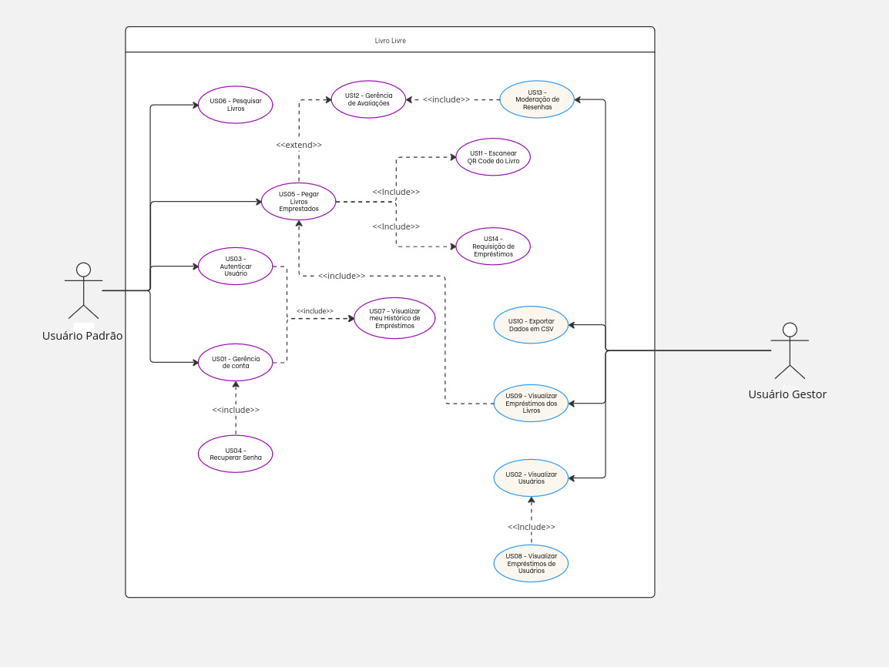
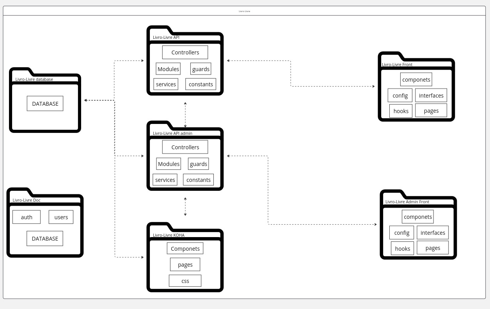
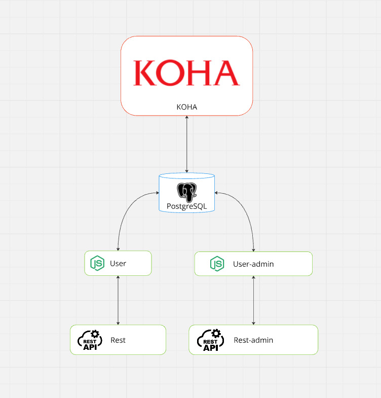
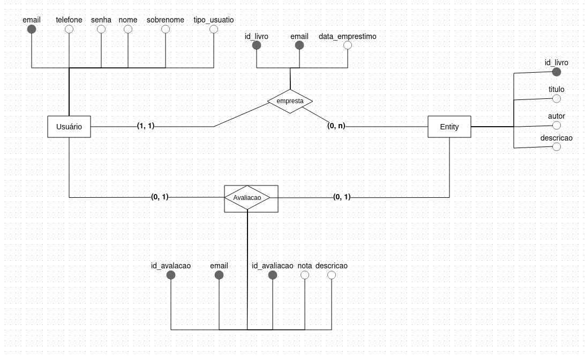
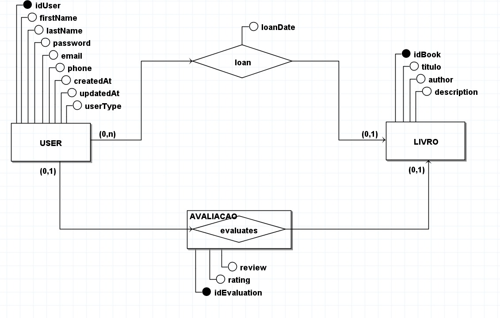
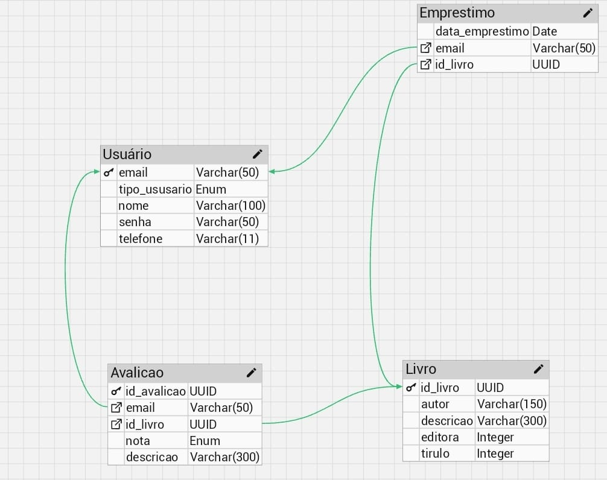
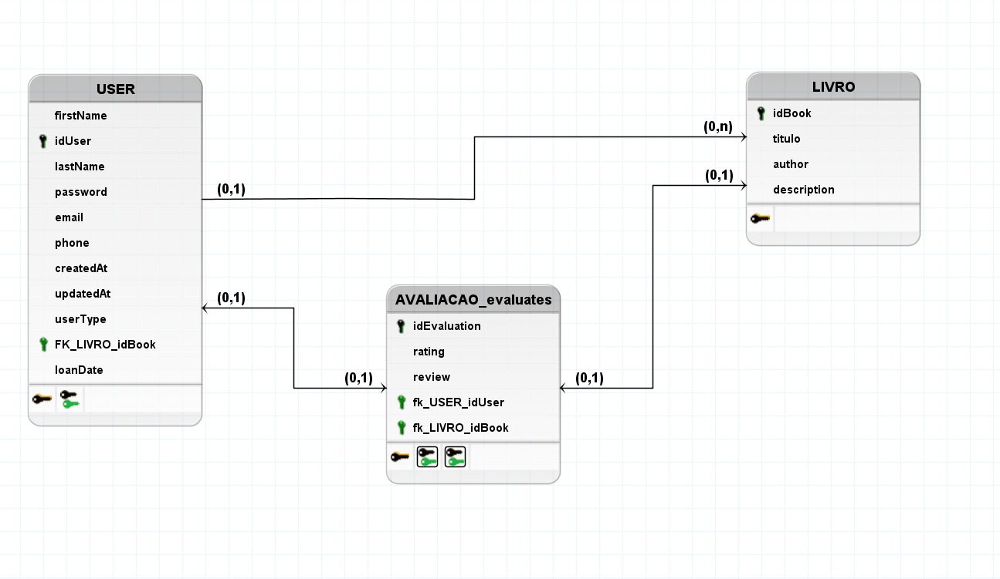

# Arquitetura

## Histórico de Revisão

| Data       | Versão | Modificação                                    | Autor              |
|------------|--------|------------------------------------------------|--------------------|
| 08/12/2024 | 0.1    | Criação do documento                           | Jonas Carlos        |
| 08/12/2024 | 0.2    | Criação dos topicos 1 e 2                      | Jonas Carlos        |
| 09/12/2024 | 0.2    | Criação dos tópico 3 a 8                      | Mateus Maia      |
| 17/12/2024 | 1.1    | Alteração dos diagramas Conceitual e Lógico                      | Mateus Maia      |

---

## 1. Introdução

### 1.1 Finalidade
Este documento de arquitetura tem como objetivo formalizar e registrar as decisões arquiteturais essenciais para a produção e implementação do projeto "Livro Livre". O software tem a finalidade de gerenciar e catalogar o acervo de livros nas estantes do projeto, controlando quais livros estão disponíveis e quais estão em uso, proporcionando um gerenciamento simples e eficiente.

### 1.2 Escopo
Este documento cobre o processo de desenvolvimento da aplicação, na qual será possível visualizar os livros cadastrados, cadastrar novos livros, verificar o status de disponibilidade (em uso ou disponível) e os detalhes relacionados a cada título. A aplicação será acessada por usuários que desejam consultar e pegar livros emprestados, sem custos ou prazos de devolução definidos.

As visões contempladas para esse modelo são:
- Visão de Casos de Uso;
- Visão Lógica.

---

## 2. Representação da Arquitetura

Modelo de representação dos serviços implementados e as interações estabelecidas entre esses serviços, bem como a natureza dessas interações.
### 2.1 Tecnologias

#### 2.1.1 Front End
**React**  
O React foi escolhido para a construção da interface do usuário devido à sua flexibilidade, eficiência e suporte a componentes reutilizáveis. Sua popularidade também facilita a manutenção e a implementação de novas funcionalidades no sistema.

**HTML, CSS e JavaScript**  
HTML e CSS são utilizados para estruturar e estilizar a interface, enquanto JavaScript complementa a interação do usuário no front-end, garantindo uma experiência dinâmica e responsiva.

#### 2.1.2 Back End
**Node.js**  
O Node.js foi selecionado para o back-end devido à sua performance e escalabilidade. Ele permite que a aplicação manipule requisições de forma eficiente, utilizando a abordagem orientada a eventos e assíncrona do Node.js.

**Python**  
Python pode ser utilizado em componentes específicos do sistema, como scripts de automação ou para tarefas de processamento de dados, dados que não exigem alta performance em tempo real, mas que são importantes para o gerenciamento do sistema.

#### 2.1.3 Banco de Dados
**PostgreSQL**  
O PostgreSQL foi escolhido como banco de dados devido à sua robustez e confiabilidade no armazenamento de dados estruturados, como informações sobre livros, usuários e status de locação. Além disso, oferece suporte a consultas complexas e garante integridade transacional, o que é essencial para garantir a precisão no gerenciamento de dados de locação.

---

## Requisitos e Restrições de Arquitetura

### 3. Requisitos

| **Escalabilidade**                | **Segurança**                                            | **Deploy**                           |
|-----------------------------------|---------------------------------------------------------|--------------------------------------|
| A aplicação deve ser escalável    | A aplicação deve tratar de forma segura os dados sensíveis dos usuários | A aplicação deve possuir deploy automatizado |

### Restrições

| **Conectividade**                                    | **Plataforma**                   | **Linguagem**                  | **Prazo**                             |
|-----------------------------------------------------|----------------------------------|--------------------------------|---------------------------------------|
| É necessária a conexão com internet para utilização do App | A aplicação terá suporte somente para Android | A aplicação será desenvolvida em português do Brasil | O escopo proposto deve ser terminado até o final da disciplina |

## 4. Visão de Casos de Uso

A Visão de Casos de Uso descreve um modelo com alta significância de alto nível em relação às funcionalidades do sistema. Normalmente feito através do Diagrama de Casos de Uso.

### 4.1 Diagrama de Casos de Uso

O Diagrama de Casos de Uso descreve as principais funcionalidades que o sistema pretende ter. Ele é constituído de atores, que representam os reais usuários do sistema e as funcionalidade do aplicativo proposto.

Segue o diagrama de casos de uso do projeto:

## 5. Visão Lógica

A Visão Lógica mostra como está a organização conceitual do sistema em termos de camadas, pacotes, classes e interfaces.

### 5.1 Diagrama de Pacotes

O Diagrama de Pacotes tem como objetivo estruturar hierarquicamente as pastas que compõem o projeto.

Segue o diagrama de pacotes do projeto:

## 6. Diagrama de Contexto

Diagrama de contexto é uma ferramenta para modelar o escopo através de um diagrama. Em desenvolvimento de sistemas, ele é considerado o diagrama de fluxo de dados de maior nível, isto é, um diagrama que representa todo o sistema. Além disso, ele demonstra como as partes interessadas e outras entidades interagem com o sistema indicando suas entradas e saídas.

## 7. Visão de Dados (banco)

A Visão de Dados mostra como está arquiteturada a camada de persistência do projeto, mapeando os objetos e os modelos de dados.

### Modelo Conceitual V1

### Modelo Conceitual V2

### Modelo Lógico V1

### Modelo Lógico V2

## 8. Referências

1. **DONG, Tao.** Flutter. [S. l.], 2019. Disponível em: [https://medium.com/flutter](https://medium.com/flutter). Acesso em: 09 dez. 2024.

2. **FLASK (FRAMEWORK WEB).** In: WIKIPÉDIA, a enciclopédia livre. Flórida: Wikimedia Foundation, 2019. Disponível em: [https://pt.wikipedia.org/w/index.php?title=Flask_(framework_web)&oldid=55329171](https://pt.wikipedia.org/w/index.php?title=Flask_(framework_web)&oldid=55329171). Acesso em: 09 dez. 2024.

3. **NODE.JS.** In: WIKIPÉDIA, a enciclopédia livre. Flórida: Wikimedia Foundation, 2019. Disponível em: [https://pt.wikipedia.org/w/index.php?title=Node.js&oldid=55592828](https://pt.wikipedia.org/w/index.php?title=Node.js&oldid=55592828). Acesso em: 09 dez. 2024.