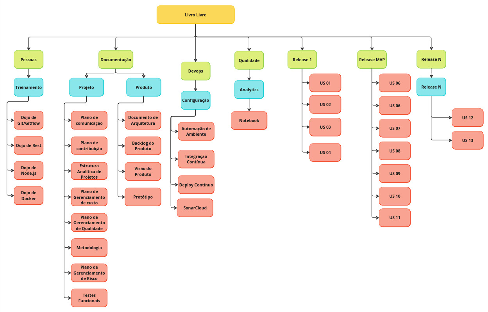

# EAP

## Versão

| **Título**        | **Alterações Feitas**                         | **Autor**  | **Data de Hoje**  |
|-------------------|---------------------------------------------------| ----------- | --------------- |
| EAP | Criação do documento EAP                   | MMateus Maia | 07 de dezembro de 2024 |

O EAP (Estrutura Analítica do Projeto) é uma ferramenta utilizada no gerenciamento de projetos para organizar e detalhar
todas as entregas e atividades necessárias para atingir os objetivos do projeto. Ele divide o trabalho em partes menores e mais gerenciáveis, representando uma hierarquia estruturada que
facilita a visualização do escopo total. O EAP serve para ajudar no planejamento, controle e monitoramento das tarefas, garantindo que nenhum elemento importante seja esquecido e que os esforços da equipe 
sejam direcionados de maneira eficiente.

## EAP - Livro Livre

