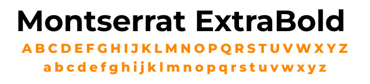
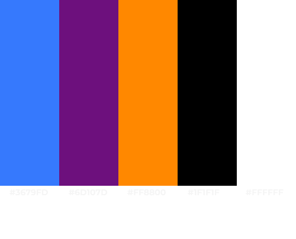

# Guia de Estilo

## Histórico de versões

|    Data    | Versão |      Descrição       |                    Autor                     |
|:----------:|:------:|:--------------------:|:--------------------------------------------:|
| 17/12/2024 |  1.0   | Criação do documento | Mateus Maia |

## 1. Introdução

Bem-vindo ao Guia de Estilo da nossa aplicação! Este documento é essencial para garantir uma experiência de usuário uniforme e coesa. Aqui, reunimos as diretrizes de design que definem a identidade visual e interativa da nossa aplicação.

Pense neste guia como um mapa que direciona a construção visual e funcional da aplicação, estabelecendo padrões para elementos como cores, tipografia e layout.

## 2. Logo

As logos da nossa aplicação são:

## 3. Tipografia

A fonte utilizada na aplicação será:

## 4. Paleta de cores

## 5. Elementos de interação

# Componentes da Interface do Usuário

- **Navbar**: Uma barra horizontal que permite a navegação pelo aplicativo. Cada item da navbar redireciona o usuário para uma tela específica.

- **Vertical Scroll Picker**: Um componente de interface que permite selecionar opções por meio de uma rolagem vertical. Ideal para escolher valores, itens ou opções em uma lista, navegando para cima ou para baixo.

- **Botão**: Elementos clicáveis que podem conter imagens ou textos. Ao serem clicados, redirecionam o usuário para o conteúdo ou executam a ação desejada.

- **Checkbox**: Um componente representado por um quadrado que pode ser marcado ou desmarcado, permitindo ao usuário ativar ou desativar múltiplas opções. É comumente usado em caixas de diálogo.

- **Campo de Pesquisa**: Um input que possibilita ao usuário realizar buscas rápidas por conteúdos no aplicativo.

- **Cards**: Blocos visuais que geralmente incluem uma imagem e uma descrição. Podem funcionar como links ou apresentar informações detalhadas, com a possibilidade de expansão para exibir mais conteúdo.

- **Formulários**: Estruturas utilizadas para coletar informações dos usuários, como em processos de login, contato ou outras interações que exigem entrada de dados.
