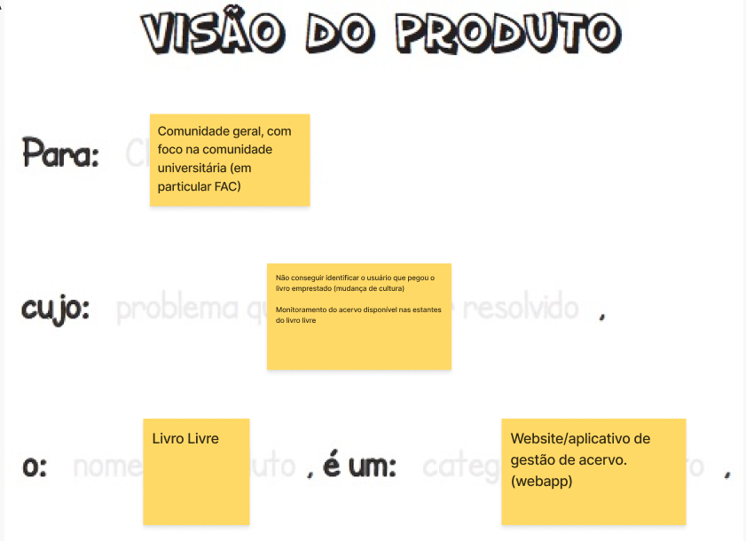
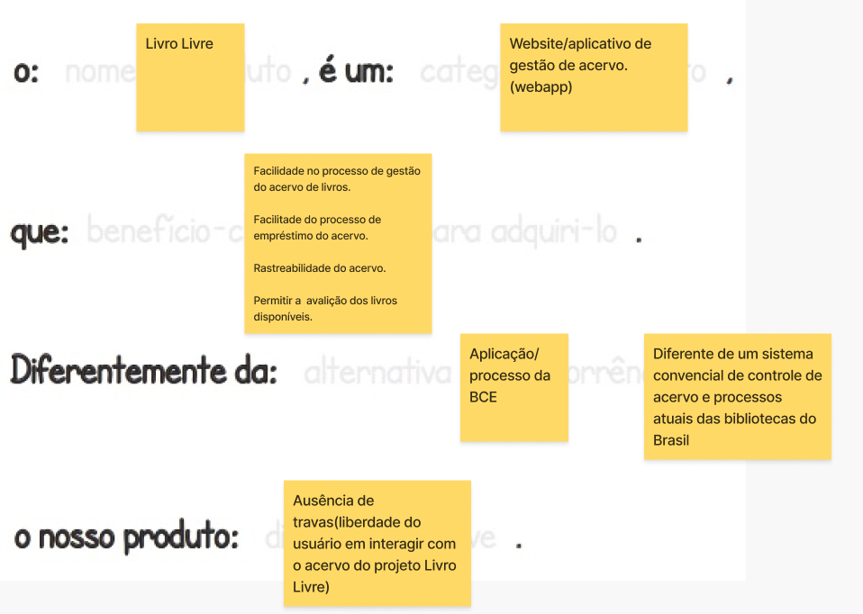
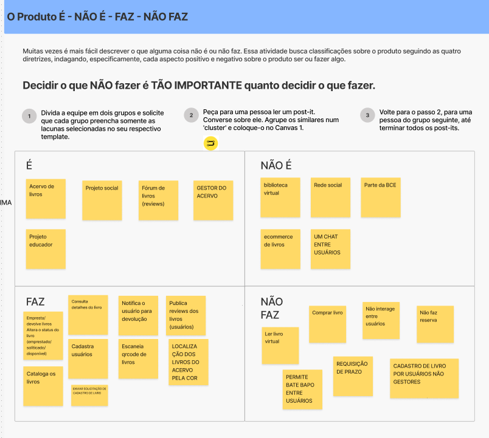
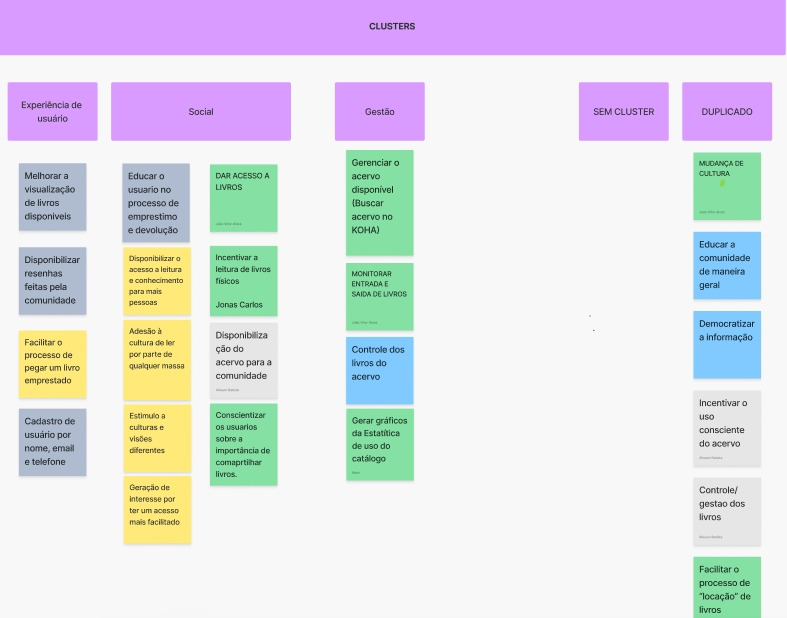

 # Lean Inception

## Versão 

| **Título**        | **Alterações Feitas**                         | **Autor**  | **Data de Hoje**       |
|-------------------|-----------------------------------------------| -----------| ---------------        |
| Lean Inception    | Subindo documento versão 1                    | João Vitor | 20 de novembro de 2024 |
| Lean Inception    | Documentação Jornada do usuário               | Bruno Cruz | 20 de novembro de 2024 |
| Lean Inception    | Documentação Obejtivos do Produto             | Pablo Cunha| 21 de novembro de 2024 |
| Lean Inception    | Documentação CanvasMVP                        | Alisson B. | 23 de novembro de 2024 |
| Lean Inception    | Documentação Sequenciador                       | Mateus Maia | 06 de dezembro de 2024 |

## Introdução

O **lean inception** é uma metodologia colaborativa usada para alinhar equipes e stakeholders na definição de um Mínimo Produto Viável (MVP) de um produto ou serviço. Ela combina práticas do Lean Startup e do Design Thinking para garantir que o produto inicial entregue ao mercado seja viável, útil e alinhado às necessidades dos usuários e do negócio.

### Capítulo 1 - Kick-off

### Capítulo 2 - Visão do Produto

  A fase da visão do produto é essencial para alinhar a visão da equipe sobre o que é o produto e definir a essência do valor de negócio colocando o usuário no centro e se comunicando com os donos do produto assim evitando interpretações diferentes para não desperdiçar tempo e recursos.

  Esses são nossos resultados:
  
  

### Capítulo 3 - É-NÃO É-FAZ-NÃO FAZ

 No capítulo do é-não é-faz-não faz, nós buscamos entender melhor como o produto deverá se comportar, suas funcionalidades, o que ele deve e não deve fazer e o que ele representa, além de definir os limtes do projeto e um esboço do escopo.Abaixo está os resultados encontrados

 

### Capítulo 4 - Objetivos do produto
 No Capitulo 4 temos como finalidade principal definir os objetivos e metas que desejamos alcançar com o produto. Cada objetivo foi analisado e agrupado em uma categoria geral que abranje as metas semelhantes. Abaixo está o resultado encotrados:

 
 
### Capítulo 5 - Personas

### Capítulo 6 - Jornada do usuário

O capítulo de Jornada do Usuário tem como objetivo promover possíveis caminhos nos quais o usuário pode realizar para alcançar seu objetivo no produto. São realizados uma sequência de passos com diferentes pontos de contato com o produto, caracterizando a interação do usuário com o produto.

Abaixo temos 3 possíveis jornadas:

### Capítulo 7 - Brainstorming de funcionalidades

### Capítulo 8 - Revisão técnica, de negócio e de UX

### Capítulo 9 - Sequenciador

O sequenciador será fundamental para determinar quais funcionalidades devem ser priorizadas no desenvolvimento do produto. A partir das funções previamente definidas, elas serão organizadas em uma sequência lógica. Essa organização permitirá identificar quais funcionalidades devem ser implementadas no menor tempo possível, formando o Produto Mínimo Viável (PMV), e quais podem ser deixadas para fases futuras. Essa lista servirá como guia para orientar o desenvolvimento do projeto.

As funcionalidades serão distribuídas em ondas, que definirão a ordem de execução das tarefas. A criação dessas ondas segue regras específicas que asseguram a geração de valor suficiente e limitam a complexidade de cada etapa:

**Regra 1**: Uma onda pode conter no máximo três cartões.

**Regra 2**: Uma onda não pode conter mais de um cartão vermelho.

**Regra 3**: Uma onda não pode conter três cartões apenas amarelos ou vermelhos.

**Regra 4**: A soma de esforço dos cartões não pode ultrapassar cinco Es.

**Regra 5**: A soma de valor dos cartões não pode ser menor que quatro $s e quatro corações.

**Regra 6**: Se um cartão depende de outro, o cartão dependido deve estar em uma onda anterior.

### Capítulo 10 - Canvas MVP

No capítulo 10, alcançamos o objetivo principal da Lean Inception: a criação do Canvas MVP. Nesse momento crucial, estruturamos de forma clara e detalhada os elementos fundamentais para o desenvolvimento do Produto Mínimo Viável (MVP), garantindo alinhamento entre a equipe e clareza sobre os próximos passos. No Canvas MVP, organizamos e refinamos os seguintes aspectos: personas, proposta do MVP, reultado esperado, funcionalidades, jornadas, custo, cronograma e as métricas para validar as hipótestes do negócio.

Esse processo final consolidou todos os aprendizados e alinhamentos realizados ao longo da Lean Inception, resultando em um plano claro e direcionado para a entrega de um MVP eficiente, focado em resolver as necessidades do público-alvo e validar o modelo de negócio com agilidade. Conforme o modelo abaixo:

