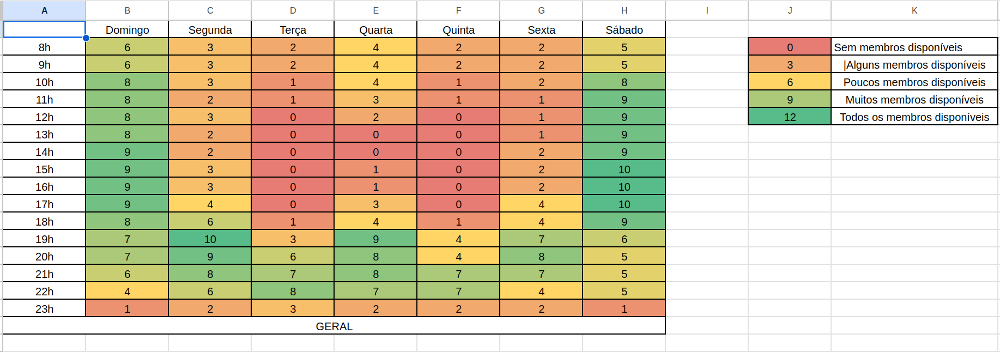

# Heatmap de Horários

## Histórico de Versões

| **Título**                   | **Alterações Feitas**                  | **Autor**      | **Data de Hoje**         |
|------------------------------|----------------------------------------|----------------|--------------------------|
| Heatmap de horários v1        | Subindo documento versão 1            | Mateus Maia    | 06 de novembro de 2024    |

Um **HeatMap**, ou mapa de calor, é uma ferramenta visual eficaz, amplamente utilizada em várias áreas, incluindo a gestão de projetos, para representar dados de maneira clara e intuitiva. No contexto de horários disponíveis de uma equipe, o HeatMap proporciona uma visão geral imediata dos períodos mais adequados para atividades, reuniões ou distribuição de tarefas ao longo do dia.

A utilidade do **HeatMap** em projetos está em sua capacidade de otimizar o uso do tempo e dos recursos da equipe, facilitando uma alocação de tarefas mais alinhada à disponibilidade de cada membro. Ao destacar visualmente os momentos de maior atividade e os períodos de menor ocupação, o **HeatMap** apoia uma coordenação mais eficiente entre os integrantes, ajudando a evitar conflitos de agenda e a aumentar a produtividade.

Abaixo temos a visualização da tabela de horário do time:

**Link:** [HeatMap](https://docs.google.com/spreadsheets/d/1bHnVTCpLXt4B1aCAXwiYF3UK9VB_C0pC81F1hnBW1nU/edit?gid=0#gid=0)
